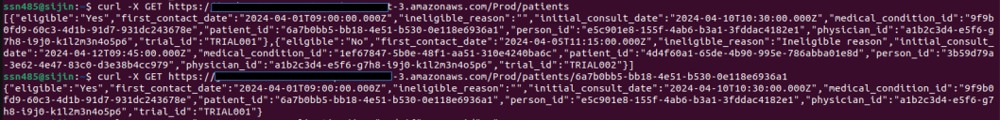
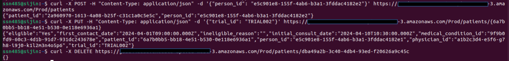

# Patient Management in a hospital
This serverless application is designed to manage patient records within a hospital setting, supporting essential Create, Read, Update, and Delete (CRUD) operations. Deployment is done using the Serverless Application Model Command Line Interface (SAM CLI). The core functionality is powered by a Flask application, integrated as a Lambda function within the AWS infrastructure. Using AWS API Gateway, a network of endpoints is established, enabling access to perform CRUD operations on patient data.

## Prerequisites for AWS deployment
1. AWS CLI installed
2. SAM CLI installed
3. AWS configured with a valid IAM user


## Deploy the application on AWS
```bash
sam build 
sam deploy 
```
The deployment output contains the API Gateway endpoint URL. Use it to access the below endpoints:
- **GetPatients:** `GET /patients`
- **GetPatient:** `GET /patients/{id}`
- **CreatePatients:** `POST /patients`
- **UpdatePatient:** `PUT /patients/{id}`
- **DeletePatient:** `DELETE /patients/{id}`

A sample api call:



## Run locally

1. Install dependencies
```bash
pip install -r patient_management/requirements.txt 
```
2. Start the application
```bash
python patient_mangement/app.py
```
3. Use the flask endpoint for performing CRUD operations

## Running unit tests

Run the following on root directory of the project:
1. Install application dependencies
```bash
pip install -r patient_management/requirements.txt
```
2. Install Unit test dependencies
```bash
pip install -r tests/requirements.txt
```
3. Running the tests
```bash
pytest
```